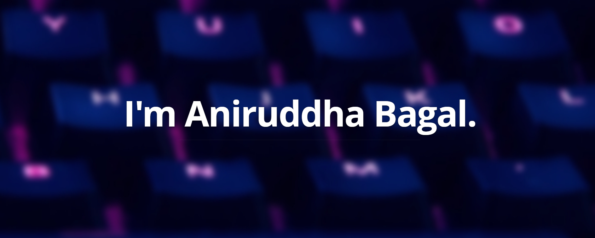

<!---
Please consider starring the repo if you find this useful in any manner
or use it. It helps me a lot.
-->

</img>

# Hi, I am <a href = "https://aniruddhabagal.co">Aniruddha</a>. Nice to see you here 👋

<b>A 21-year-old, pursuing B.Tech in Computer Science from [Vidyavardhaka College Of Engineering](https://vvce.ac.in)</b> 
I am a driven Full-Stack developer with a focus on 👨‍💻 building cutting-edge productsusing React and React-Native. I specialize in building scalable backends powered by PHP, NodeJS, and Golang, ensuring high-performance and seamless userexperiences. 

I am also the GitHub Campus Expert 🚩 and Lead of Google Developers Student Club at my campus. Through these programs I conduct workshops, events, and collaborative programs in science, innovation, computers, entrepreneurship, etc.

- 🔭 Check out my <a href="https://aniruddhabagal.co"><b>Portfolio Website</b></a>
- 🌱 I look for opportunities to use my skills to solve challenging real-world problems.
- 🪶 I try to offer my contribution which realises the power of community.
- 👯 I am open to collaboration with creators, developers and tech enthusiasts.
- 🚢 Keen on developing my skill set and putting it to use. 

## 📩 Connect with me

Don't hesitate to ping me🤝. If you are interested to discuss any further, I'm always open for a conversation!!✔ Shoot me an email <a href = "mailto:bagalaniruddha@gmail.com"><b>here</b>  

## ⚡ Languages, Tools and Technologies

<table>
<tr>
	<td><strong>Frontend & Design</strong></td>
	<td><strong>DevOps & Deployment</strong></td>
	<td><strong>Version Control</strong></td>
	<td><strong>Editors</strong></td>
</tr>
<tr>
	<td></td>
	<td></td>
	<td></td>
	<td></td>
</tr>
</table>
<table>
<tr>
	<td><strong>Backend & Databases</strong></td>
	<td><strong>API & Testing</strong></td>
	<td><strong>Languages</strong></td>
	<td><strong>Miscellaneous</strong></td>
</tr>
<tr>
	<td></td>
	<td></td>
	<td></td>
	<td></td>
</tr>
</table>

## 📊 Metrics

<table>
	<tr>
		<td colspan = "2"></td>
	</tr>
	<tr>
		<td></td>
		<td></td>
	</tr>
	<tr>
		<td colspan = "2"></td>
	</tr>
	</table>
<!-- 
 -->
<!-- 
<h2>✒️ Recent GitHub Activity</h1>
 -->

<!-- 

<h3><b>Visits Count 👁️</b></h3>
 -->
 
### Show some ❤️ by starring 🌟 some of my repos!

